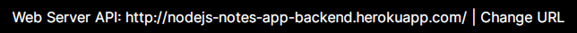

# notes-app-back-end
This Project is from Course at [Dicoding](https://www.dicoding.com/academies/261) and Deploy to [Heroku](https://www.heroku.com)

[](https://heroku.com/deploy)

### Application
- Open [Client App](http://notesapp-v1.dicodingacademy.com)
- Please select  **"Change URL"**
<p align="center">

</p>

- Then, fill it with :
```
nodejs-notes-app-backend.herokuapp.com
```
<p align="center">

</p>

- Once you see the URL of the web server, the web server and client application are connected.
<p align="center">

</p>


### License
This project is licensed under the ISC License - see the [LICENSE](LICENSE.md) file for details
